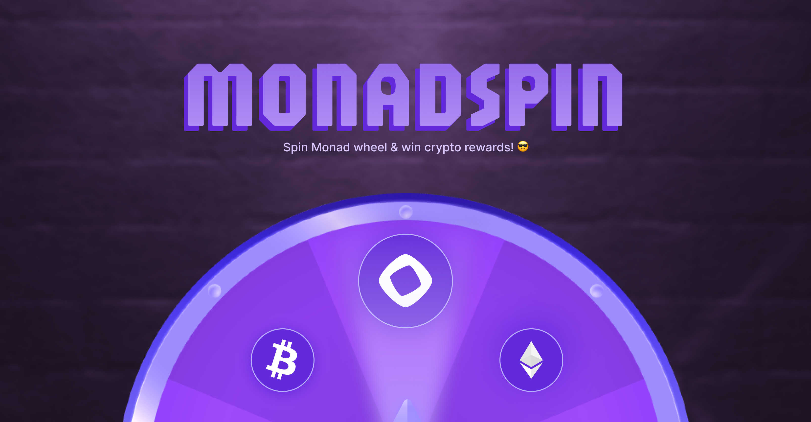
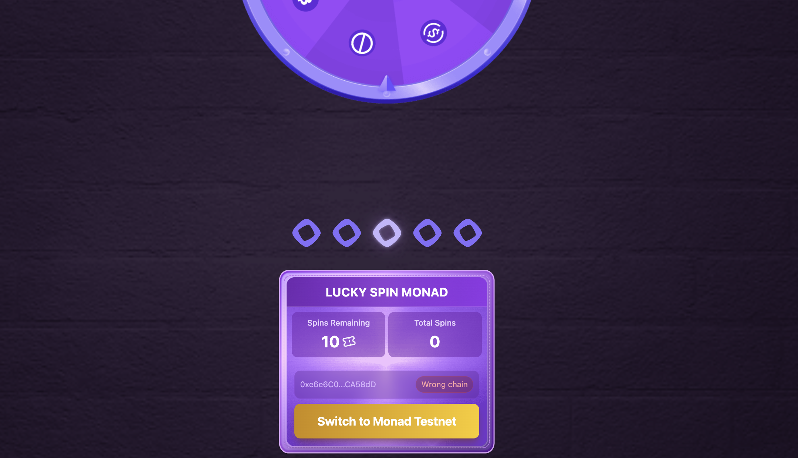

   

## Unlocking Web3 Engagement and Onboarding on Monad

MonadSpin is an innovative platform designed to revolutionize user interaction and community growth within the Monad ecosystem. By blending gamified experiences with seamless social integration, MonadSpin addresses critical challenges facing the Web3 space today, making blockchain technology more accessible, engaging, and rewarding for everyone.

## Screenshots

  

    
  

  

    
  

## The Challenges We Solve:

*   **Simplifying Web3 Onboarding:** We transform the often-complex entry into the Monad ecosystem into an exciting "spin-to-earn" adventure, making it intuitive and fun for newcomers.
*   **Boosting User Engagement:** Combatting the common issue of fleeting interest in crypto projects, MonadSpin provides compelling daily incentives and interactive mechanics to foster sustained participation.
*   **Fostering Vibrant Communities:** By building a seamless bridge between popular social platforms like Farcaster and Twitter and direct blockchain interaction, we cultivate a more connected and dynamic Web3 community.
*   **Equitable Token Distribution:** MonadSpin offers a transparent and fair mechanism for distributing tokens and rewards, ensuring active community members are recognized and incentivized.
*   **Enhancing Cross-Platform Experience:** With native integration for Farcaster frames, users can effortlessly engage with the Monad ecosystem directly from their social feeds, enhancing reach and convenience.

## How MonadSpin Transforms Your Web3 Journey:

*   **Effortless Interaction:** Claiming rewards is streamlined to just a few clicks, abstracting away the underlying blockchain complexities for a smoother user experience.
*   **Powerful Social Reach:** Share your achievements and contribute to community growth with easy-to-use social sharing features, amplified by Farcaster's integrated experience.
*   **Fortified Security:** Built on a foundation of robust Web3 security practices, MonadSpin ensures all wallet connections and transactions are safe and protected.
*   **Consistent Daily Engagement:** The unique daily spin mechanic encourages consistent, enjoyable interaction with the Monad ecosystem, keeping you connected and rewarded.
*   **Crystal-Clear Rewards:** Experience complete transparency with a clear visualization of potential rewards and spin mechanics, building unwavering trust with our user base.

MonadSpin is more than just a game; it's your intuitive portal to the expansive Monad ecosystem, crafted to make Web3 not only accessible but truly captivating.

## Farcaster Mini App
Explore FarRank on Farcaster: [https://farcaster.xyz/miniapps/TLIZwXHJazk2/monad-spin](https://farcaster.xyz/miniapps/TLIZwXHJazk2/monad-spin)
